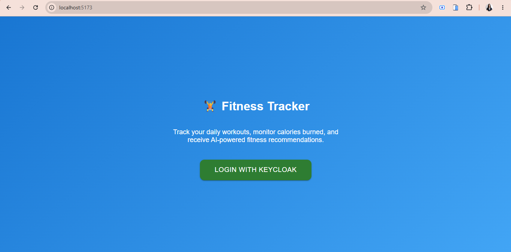
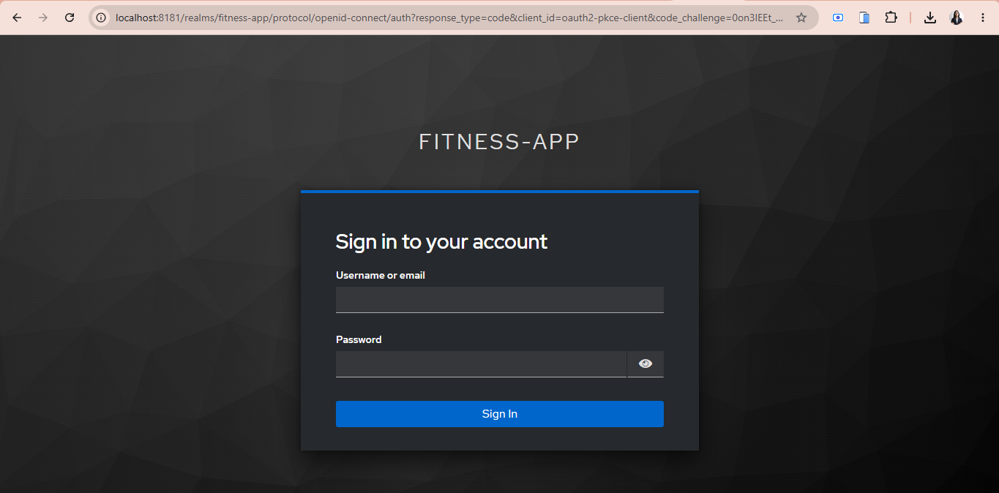
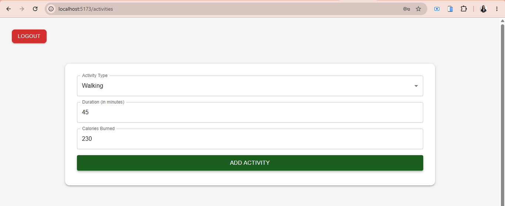
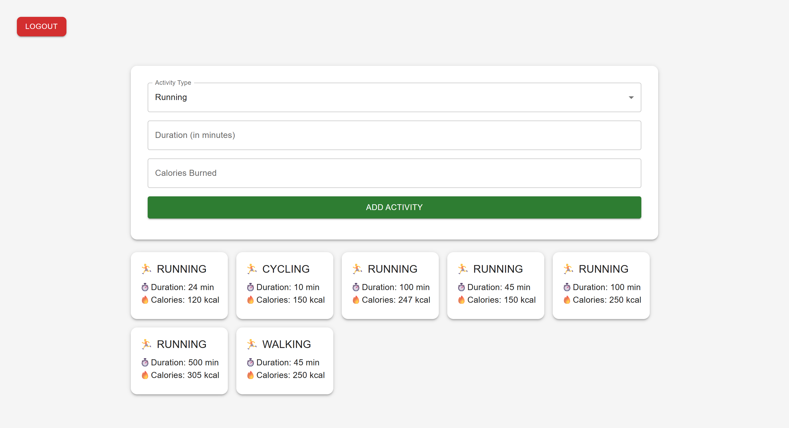
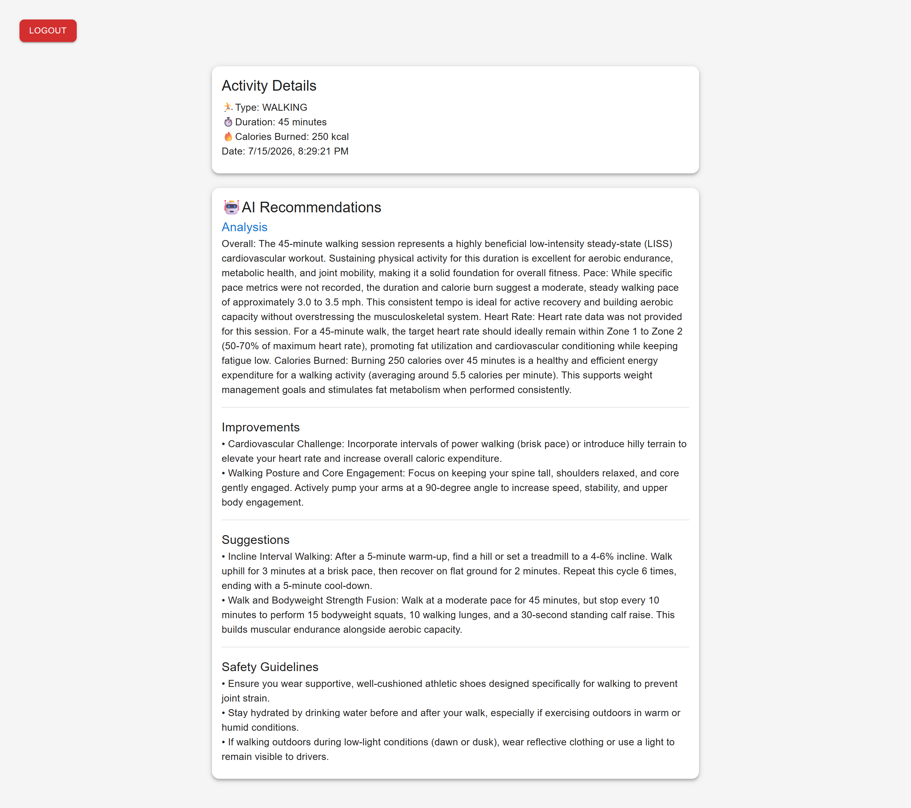

# 🏋️ AI-Powered Fitness Tracking System using Spring Boot Microservices

A full-stack fitness tracking application built using Spring Boot Microservices, React.js, Kafka, Keycloak, PostgreSQL, MongoDB, Eureka Service Discovery, API Gateway, and AI-powered recommendations.

---

## 📖 Project Overview

This is a Full-Stack AI-powered Fitness Tracking application built using Spring Boot Microservices and React.js. Users can securely authenticate using Keycloak, log fitness activities, and receive AI-generated workout recommendations. 

The application follows a Microservices Architecture with both synchronous and asynchronous communication using REST APIs and Apache Kafka.

---

## 🔗 Repository

GitHub: https://github.com/SnehalKrushnaBandal/fitness-microservices

---

## ✨ Features

- ✔ User Authentication using Keycloak
- ✔ JWT-based Authorization
- ✔ API Gateway with Spring Cloud Gateway
- ✔ Eureka Service Discovery
- ✔ Client-side Load Balancing
- ✔ Activity Tracking System
- ✔ MongoDB Integration
- ✔ PostgreSQL User Management
- ✔ Kafka Producer & Consumer
- ✔ AI-powered Recommendation Generation
- ✔ Activity Detail Page
- ✔ Material UI Responsive Interface
- ✔ RESTful APIs
- ✔ React Routing
- ✔ Axios API Integration

---

## 🛠️ Technologies Used

### Frontend
- React.js
- Material UI
- Axios
- React Router

### Backend
- Spring Boot
- Spring Cloud Gateway
- Spring Cloud Config
- Spring Security
- Spring Data MongoDB
- Spring Data JPA
- Spring Web

### Databases
- **MongoDB** – Stores fitness activities and AI recommendations
- **PostgreSQL** – Stores user information

### Authentication
- Keycloak (OAuth2 / OpenID Connect)

### Service Discovery
- Eureka Server

### Messaging
- Apache Kafka
- Kafka Producer
- Kafka Consumer

### AI Integration
- AI Recommendation Microservice
- AI-based Fitness Recommendation Engine

---

## 🏗️ System Architecture


---

## 📂 Project Structure

```text
fitness-microservices/
│
├── activityservice/
├── userservice/
├── aiservice/
├── gateway/
├── configserver/
├── eureka/
├── fitness-frontend/
└── README.md
```
---

## ⚙️ How to Run the Project

### Prerequisites

Before running the project, make sure the following are installed:

- Java 17+
- Maven
- Node.js & npm
- PostgreSQL
- MongoDB
- Apache Kafka
- Keycloak
- Git

### Clone the Repository

```bash
git clone https://github.com/SnehalKrushnaBandal/fitness-microservices.git
cd fitness-microservices
```

### Start the Backend Services

Run the services in the following order:

1. Config Server
2. Eureka Server
3. User Service
4. Activity Service
5. AI Service
6. Gateway Service

### Start the Frontend

```bash
cd fitness-frontend
npm install
npm run dev
```

Open the application in your browser:

```
http://localhost:5173
```
---

## 📸 Screenshots

### Login



---

### Keycloak Login 



---

### Dashboard


---

### Add Activity



---

### Activity List



---

### AI Recommendation



---

## 🔄 Application Workflow

1. User logs in using **Keycloak**.
2. Keycloak generates a **JWT Token**.
3. React stores the JWT token and User ID.
4. User enters:
   - Activity Type
   - Duration
   - Calories Burned
5. Activity Service validates the user synchronously using the User Service.
6. Activity is saved in **MongoDB**.
7. Activity is published to **Apache Kafka**.
8. AI Recommendation Service consumes the Kafka message.
9. AI Model generates personalized recommendations.
10. Recommendation Service stores the generated recommendation.
11. Clicking an activity displays:
    - Activity Details
    - AI Analysis
    - Improvements
    - Suggestions
    - Safety Guidelines

---

## 🚀 Future Enhancements

- ✔ Edit existing fitness activities
- ✔ Delete activities
- ✔ Search and filter activities
- ✔ Activity analytics with charts and progress dashboard
- ✔ Fitness goals and achievement tracking
- ✔ AI-powered personalized workout and diet plans
- ✔ Dark Mode support
- ✔ Docker and Kubernetes deployment
- ✔ CI/CD pipeline using GitHub Actions

---

## 👨‍💻 Author

**Snehal Krushna Bandal**

- GitHub: https://github.com/SnehalKrushnaBandal
- LinkedIn: https://www.linkedin.com/in/snehal-bandal-514592267


